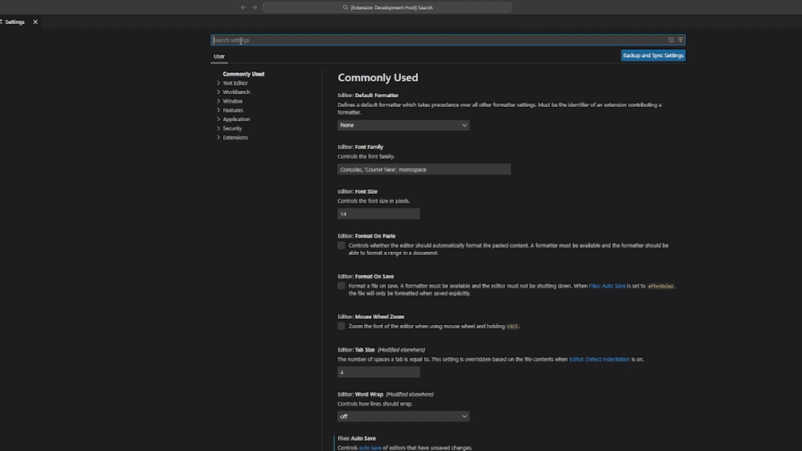

  

  

  

# Dynamic Theme for VS Code 🎨

**Modify your VS Code theme to whatever you want with infinite possibilities!**

Dynamic Theme allows you to customize specific parts of the VS Code interface (buttons, lists, activity bar, etc.) directly from your settings, generating a unique theme file on the fly.

## ✨ Features
- **Full Control**: Customize over 100+ UI elements including SideBar, StatusBar, Buttons, and Terminal colors.
- **Dynamic Generation**: The theme regenerates automatically when you change settings.
- **Native Integration**: Works seamlessly with VS Code's configuration via `settings.json`.

## 🚀 How to use
1. Install the extension.
2. Go to **Settings** (`Ctrl+,` / `Cmd+,`).
3. Search for `Theme Archetict`.
4. Pick a color for any element (e.g., set `dynamicTheme.ActivityBar.activityBarbackground` to `#ff0000`).

### example
